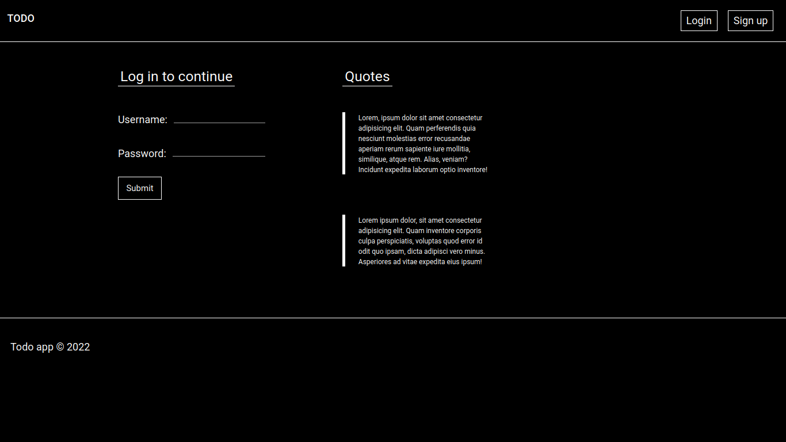
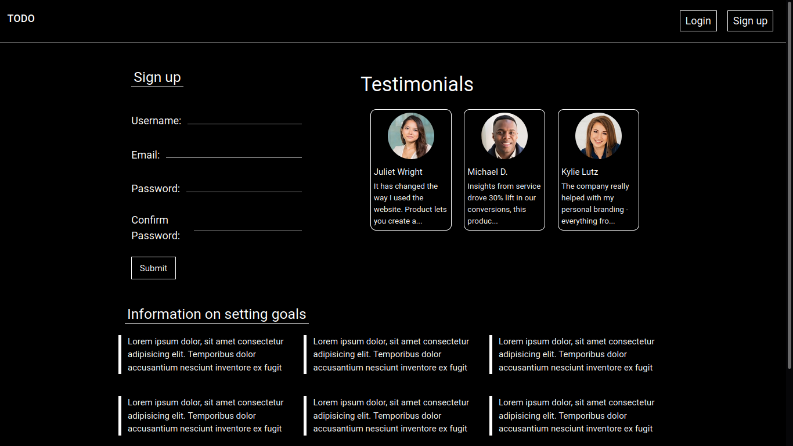
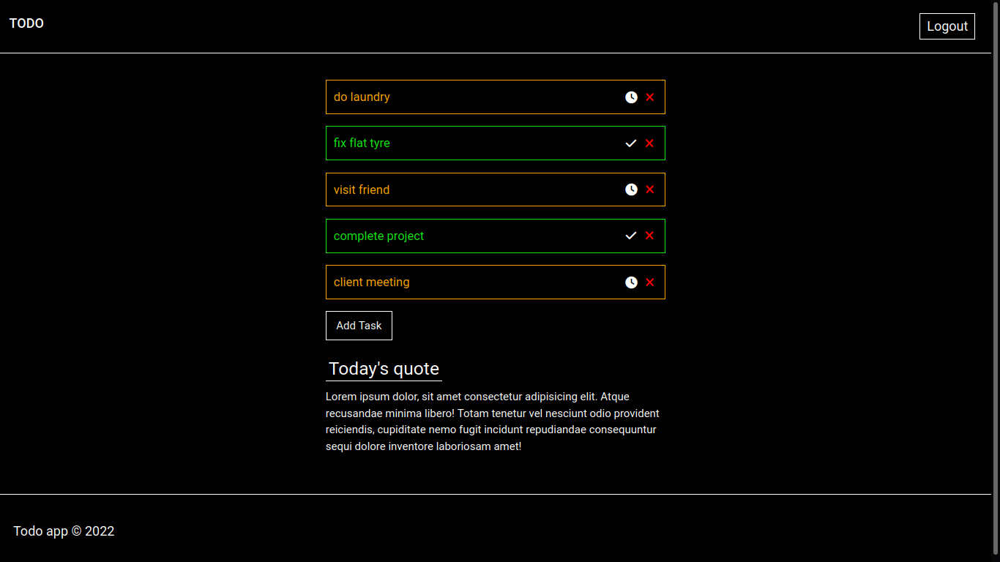

# Banking application

***

## Previews
> [Click here](https://) for live demo
> 
> **Login page**
> 
> 
>**Sign up page**
> 
> 
> **User home page**
> 

## Description
A simple todo list
This application is for keeping record of todo items
Once a user creates an account, they will be able to login and:
1. Create todo items
2. Mark a todo item as either done or undone
3. Delete a todo item

## Usage
Clone the repository

From the root of the project, change directory to the `backend` folder

Open up terminal or command line in the `backend` folder

**Make sure the `DJANGO_KEY` environment variable is set. It will be used as the secret key value. You can adjust this in `settings.py`**

Create a virtual environment in the current directory.

Activate the virtual environment

Information on virtual environment creation and activation can be found [here](https://docs.python.org/3/library/venv.html)

Run `pip install -r requirements.txt` to install project dependencies. If pip is not present on your system, you can find guidelines on installation [here](https://pip.pypa.io/en/stable/installation/)

Set the `DJANGO_KEY` environment variable

Run `python manage.py runserver`

## Technologies used
1. python django framework
2. vue js

The frontend is a single page application which accesses the backend as a rest api.
JWT is used for authentication
